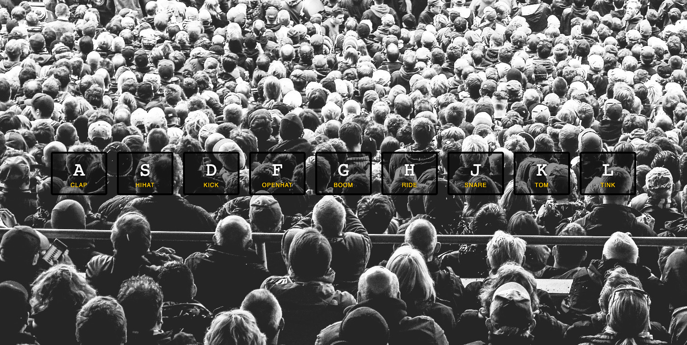

# Javascript30-1
 This is a 30 day JavaScript Challenge. Challenge #1 Drumkit
 
## Table of contents

- [Overview](#overview)
  - [The challenge](#the-challenge)
  - [Screenshot](#screenshot)
  - [Links](#links)
- [My process](#my-process)
  - [Built with](#built-with)
  - [What I learned](#what-i-learned)
  - [Continued development](#continued-development)
  - [Useful resources](#useful-resources)
- [Author](#author)

## Overview

### The challenge

- Build out the project to the designs provided

### Screenshot




### Links

- Solution URL: [https://github.com/kryde507/Javascript30-1](https://github.com/kryde507/Javascript30-1)

## My process

### Built with

- Vanilla JavaScript

### What I learned

In this project I learned about I learned about data attributes, how to play audio clips, reseting audio clips to 0 for repetitive sounds, and that .keyCode is deprecated.


The following JavaScript snippet is used to play the audio and reset it eahc time a key is pressed:
```js
if (e.code === sound.dataset.key) {
            sound.currentTime = 0; 
            sound.play();
```


### Continued development

I would like to improve on my refactoring abilities, as well as understand when a function should be defined within an event or outside of it. 

### Useful resources

- [MDN Data Attributes](https://developer.mozilla.org/en-US/docs/Learn/HTML/Howto/Use_data_attributes) - This helped me understand data attributes.

## Author

- GitHub - [KRyde507](https://github.com/kryde507)

